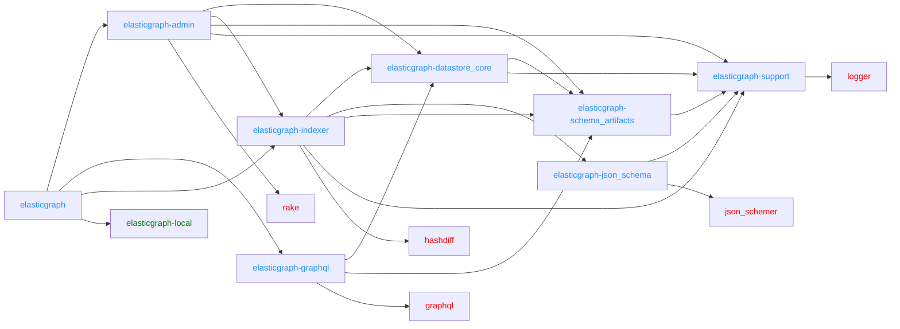
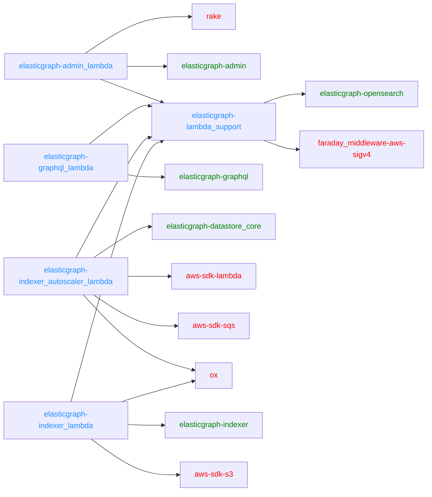
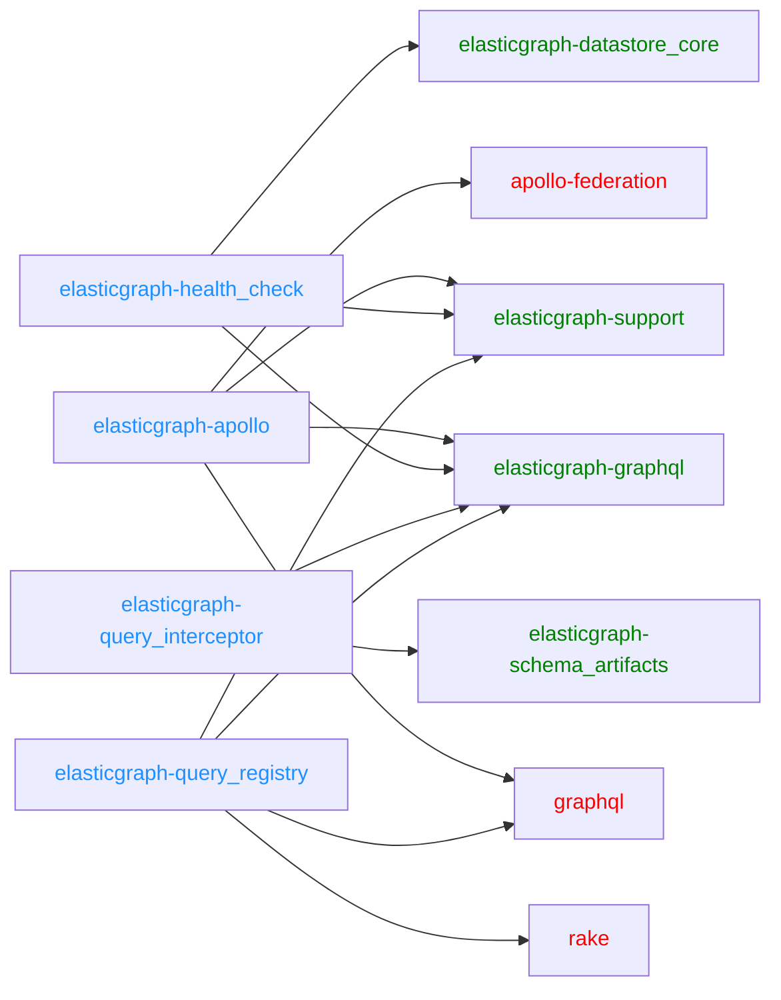
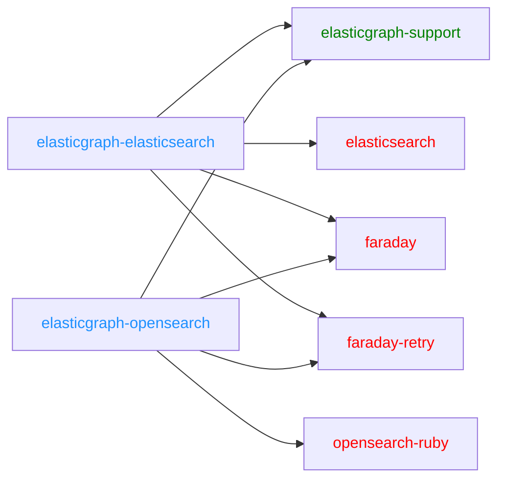
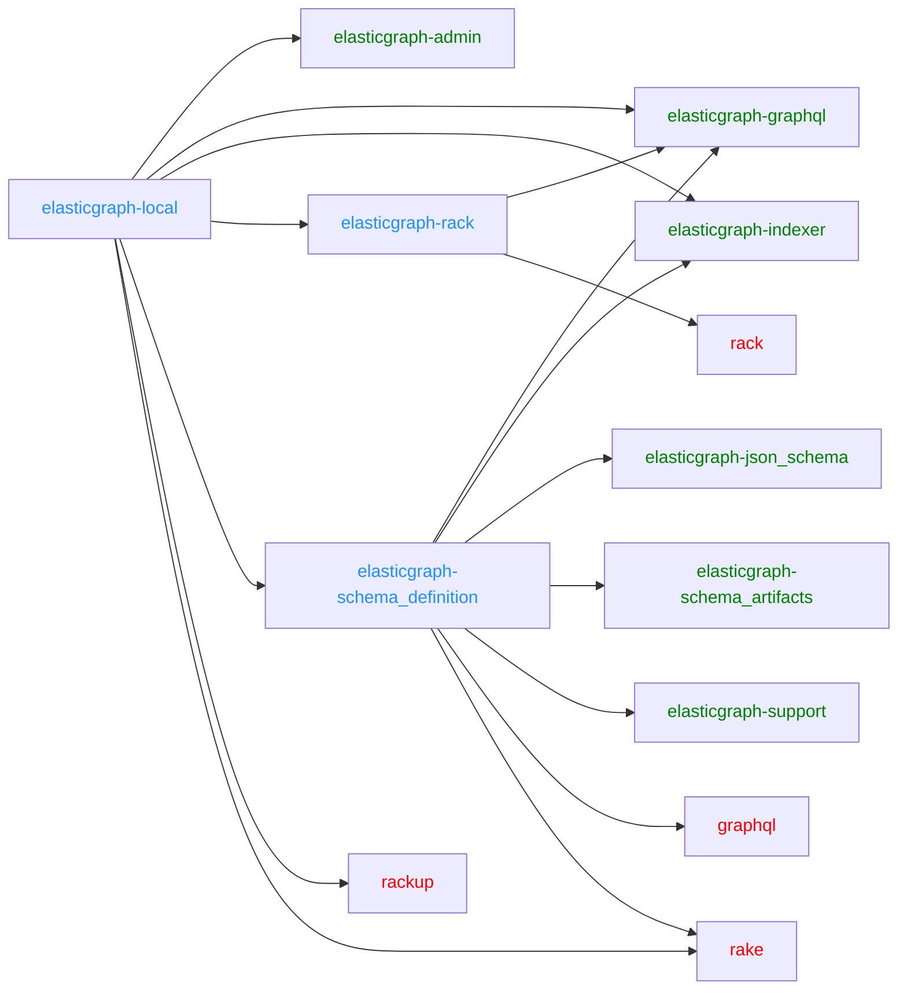

# ElasticGraph

ElasticGraph is a general purpose, near real-time data query and search platform that is scalable and performant,
serves rich interactive queries, and dramatically simplifies the creation of complex reports. The platform combines
the power of indexing and search of Elasticsearch or OpenSearch with the query flexibility of GraphQL language.
Optimized for AWS cloud, it also offers scale and reliability.

ElasticGraph is a naturally flexible framework with many different possible applications. However, the main motivation we have for
building it is to power various data APIs, UIs and reports. These modern reports require filtering and aggregations across a body of ever
growing data sets. Modern APIs allow us to:

- Minimize network trips to retrieve your data
- Get exactly what you want in a single query. No over- or under-serving the data.
- Push filtering complex calculations to the backend.

## Libraries

ElasticGraph is designed to be modular, with a small core, and many built-in extensions that extend that core
for specific use cases. This minimizes exposure to vulnerabilities, reduces bloat, and makes ongoing upgrades
easier. The libraries that ship with ElasticGraph can be broken down into several categories.

### Core Libraries (8 gems)

These libraries form the core backbone of ElasticGraph that is designed to run in a production deployment. Every ElasticGraph deployment will need to use all of these.

* [elasticgraph](elasticgraph/README.md): ElasticGraph meta-gem that pulls in all the core ElasticGraph gems.
* [elasticgraph-admin](elasticgraph-admin/README.md): ElasticGraph gem that provides datastore administrative tasks, to keep a datastore up-to-date with an ElasticGraph schema.
* [elasticgraph-datastore_core](elasticgraph-datastore_core/README.md): ElasticGraph gem containing the core datastore support types and logic.
* [elasticgraph-graphql](elasticgraph-graphql/README.md): The ElasticGraph GraphQL query engine.
* [elasticgraph-indexer](elasticgraph-indexer/README.md): ElasticGraph gem that provides APIs to robustly index data into a datastore.
* [elasticgraph-json_schema](elasticgraph-json_schema/README.md): ElasticGraph gem that provides JSON Schema validation.
* [elasticgraph-schema_artifacts](elasticgraph-schema_artifacts/README.md): ElasticGraph gem containing code related to generated schema artifacts.
* [elasticgraph-support](elasticgraph-support/README.md): ElasticGraph gem providing support utilities to the other ElasticGraph gems.

#### Dependency Diagram

### AWS Lambda Integration Libraries (5 gems)

These libraries wrap the the core ElasticGraph libraries so that they can be deployed using AWS Lambda.

* [elasticgraph-admin_lambda](elasticgraph-admin_lambda/README.md): ElasticGraph gem that wraps elasticgraph-admin in an AWS Lambda.
* [elasticgraph-graphql_lambda](elasticgraph-graphql_lambda/README.md): ElasticGraph gem that wraps elasticgraph-graphql in an AWS Lambda.
* [elasticgraph-indexer_autoscaler_lambda](elasticgraph-indexer_autoscaler_lambda/README.md): ElasticGraph gem that monitors OpenSearch CPU utilization to autoscale indexer lambda concurrency.
* [elasticgraph-indexer_lambda](elasticgraph-indexer_lambda/README.md): Provides an AWS Lambda interface for an elasticgraph API
* [elasticgraph-lambda_support](elasticgraph-lambda_support/README.md): ElasticGraph gem that supports running ElasticGraph using AWS Lambda.

#### Dependency Diagram

### Extensions (4 gems)

These libraries extend ElasticGraph to provide optional but commonly needed functionality.

* [elasticgraph-apollo](elasticgraph-apollo/README.md): An ElasticGraph extension that implements the Apollo federation spec.
* [elasticgraph-health_check](elasticgraph-health_check/README.md): An ElasticGraph extension that provides a health check for high availability deployments.
* [elasticgraph-query_interceptor](elasticgraph-query_interceptor/README.md): An ElasticGraph extension for intercepting datastore queries.
* [elasticgraph-query_registry](elasticgraph-query_registry/README.md): An ElasticGraph extension that supports safer schema evolution by limiting GraphQL queries based on a registry and validating registered queries against the schema.

#### Dependency Diagram

### Datastore Adapters (2 gems)

These libraries adapt ElasticGraph to your choice of datastore (Elasticsearch or OpenSearch).

* [elasticgraph-elasticsearch](elasticgraph-elasticsearch/README.md): Wraps the Elasticsearch client for use by ElasticGraph.
* [elasticgraph-opensearch](elasticgraph-opensearch/README.md): Wraps the OpenSearch client for use by ElasticGraph.

#### Dependency Diagram

### Local Development Libraries (3 gems)

These libraries are used for local development of ElasticGraph applications, but are not intended to be deployed to production (except for `elasticgraph-rack`).
`elasticgraph-rack` is used to boot ElasticGraph locally but can also be used to run ElasticGraph in any rack-compatible server (including a Rails application).

* [elasticgraph-local](elasticgraph-local/README.md): Provides support for developing and running ElasticGraph applications locally.
* [elasticgraph-rack](elasticgraph-rack/README.md): ElasticGraph gem for serving an ElasticGraph GraphQL endpoint using rack.
* [elasticgraph-schema_definition](elasticgraph-schema_definition/README.md): ElasticGraph gem that provides the schema definition API and generates schema artifacts.

#### Dependency Diagram

## Versioning Policy

ElasticGraph does _not_ strictly follow the [SemVer](https://semver.org/) spec. We followed that early in the project's life
cycle and realized that it obscures some important compatibility information.

ElasticGraph's versioning policy is designed to communicate compatibility information related to the following stakeholders:

* **Application maintainers**: engineers that define an ElasticGraph schema, maintain project configuration, and perform upgrades.
* **Data publishers**: systems that publish data into an ElasticGraph application for ingestion by an ElasticGraph indexer.
* **GraphQL clients**: clients of the GraphQL API of an ElasticGraph application.

We use the following versioning scheme:

* Version numbers are in a `0.MAJOR.MINOR.PATCH` format. (The `0.` prefix is there in order to reserve `1.0.0` and all later versions
  for after ElasticGraph has been open-sourced).
* Increments to the PATCH version indicate that the new release contains no backwards incompatibilities for any stakeholders.
  It may contain bug fixes, new features, internal refactorings, and dependency upgrades, among other things. You can expect that
  PATCH level upgrades are always safe--just update the version in your bundle, generate new schema artifacts, and you should be done.
* Increments to the MINOR version indicate that the new release contains some backwards incompatibilities that may impact the
  **application maintainers** of some ElasticGraph applications. MINOR releases may include renames to configuration settings,
  changes to the schema definition API, and new schema definition requirements, among other things. You can expect that MINOR
  level upgrades can usually be done in 30 minutes or less (usually in a single commit!), with release notes and clear errors
  from ElasticGraph command line tasks providing guidance on how to upgrade.
* Increments to the MAJOR version indicate that the new release contains some backwards incompatibilities that may impact the
  **data publishers** or **GraphQL clients** of some ElasticGraph applications. MAJOR releases may include changes to the GraphQL
  schema that require careful migration of **GraphQL clients** or changes to how indexing is done that require a dataset to be
  re-indexed from scratch (e.g. by having **data publishers** republish their data into an ElasticGraph indexer running the new
  version). You can expect that the release notes will include detailed instructions on how to perform a MAJOR version upgrade.

Deprecation warnings may be included at any of these levels--for example, a PATCH release may contain a deprecation warning
for a breaking change that may impact **application maintainers** in an upcoming MINOR release, and a MINOR release may
contain deprecation warnings for breaking changes that may impact **data publishers** or **GraphQL clients** in an upcoming
MAJOR release.

Each version level is cumulative over the prior levels. That is, a MINOR release may include PATCH-level changes in addition
to backwards incompatibilities that may impact **application maintainers**. A MAJOR release may include PATCH-level or
MINOR-level changes in addition to backwards incompatibilities that may impact **data publishers** or **GraphQL clients**.

Note that this policy was first adopted in the `v0.15.1.0` release.  All prior releases aimed (with some occasional mistakes!)
to follow SemVer with a `0.MAJOR.MINOR.PATCH` versioning scheme.

Note that _all_ gems in this repository share the same version number. Every time we cut a release, we increment the version
for _all_ gems and release _all_ gems, even if a gem has had no changes since the last release. This is simpler to work with
than the alternatives.
